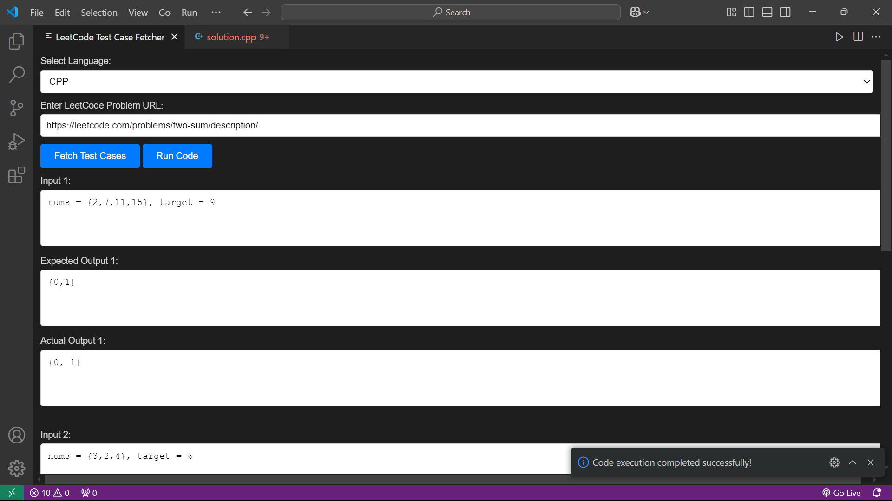

# LeetCode Test Case Fetcher VS Code Extension

This VS Code extension allows you to fetch LeetCode problem test cases, run your solution code against those cases, and view the actual output directly in the extension by writing the code. It supports multi-language code execution and provides a streamlined interface for fetching, storing, and testing LeetCode problem solutions.

## Features
- **Problem URL Fetching**: Fetch test cases from LeetCode problem URLs and extract both input and expected output.
- **Test Case Storage**: Store test cases as `input_X.txt` and `output_X.txt` files for local testing.
- **Test Case Editing**: Modify the test cases directly within the extension interface and save the changes seamlessly.
- **Code Execution**: Run your code against the fetched test cases and compare actual outputs with expected ones.
- **Multi-Language Support**: Execute code in multiple languages (e.g., Python, C++)
- **GUI Interface**: A user-friendly webview interface to input LeetCode URLs, display test cases, and view outputs.
- **Error Handling**: If the code fails to produce output, an error message is displayed.

## Quick Start

1. **Install the Extension**: Install the `LeetCode Test Case Fetcher` extension in your VS Code.
2. **Fetch Test Cases**: Copy the problem URL from LeetCode, click on `Fetch Test Cases` to load inputs and expected outputs.
3. **Edit Test Cases**: Modify the fetched test cases directly within the extension before running your code.
3. **Write Code**: Open the solution file, write your code in the provided template, and save it.
4. **Run Code**: Click on `Run Code` to execute your solution. The extension will show the actual outputs for each test case and store them in the `outputs` folder.

## Prerequisites
- **VS Code** installed.
- **Node.js and npm** installed.